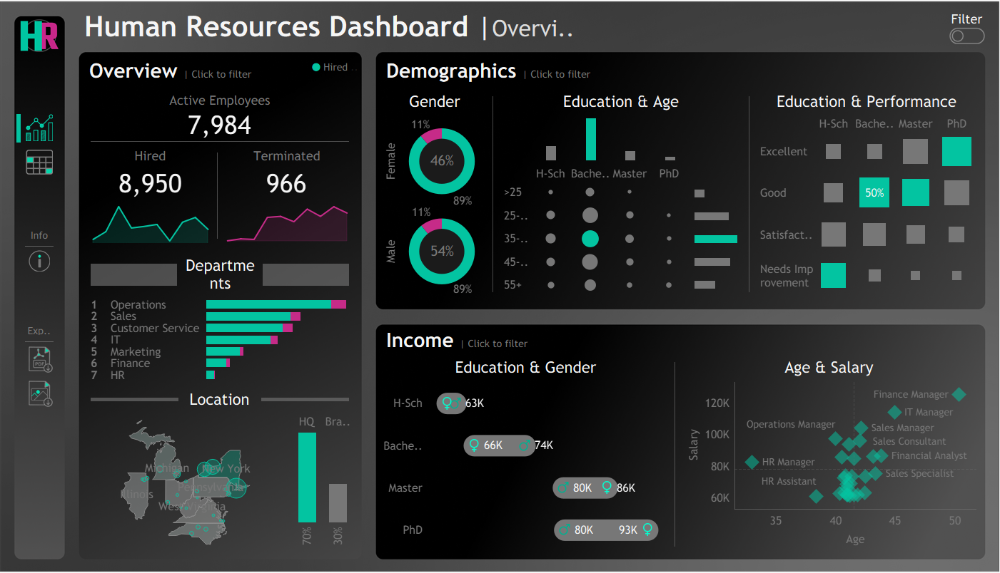

# HR-statistical-analysis

# 📊 Workforce Analytics Hub

## Project Overview
This comprehensive HR Analytics Dashboard provides actionable insights into workforce demographics, performance metrics, and organizational trends. Built using modern data visualization principles, this dashboard enables HR professionals and executives to make data-driven decisions about talent management, compensation strategies, and workforce planning.

## 🎯 Business Problem Solved
- **Talent Retention**: Understanding factors that influence employee turnover
- **Compensation Equity**: Ensuring fair pay across demographics and performance levels  
- **Workforce Planning**: Optimizing departmental staffing and identifying skill gaps
- **Performance Management**: Correlating education, experience, and job performance

## 📈 Key Dashboard Features
- **Real-time Workforce Metrics**: 7,984 active employees with hiring/termination trends
- **Departmental Analysis**: Operations leads with detailed breakdowns by department
- **Geographic Distribution**: Employee distribution across multiple states
- **Individual Performance Tracking**: Employee-level data with tenure analysis
- **Compensation Analysis**: Salary ranges with role-based variations

## 🔧 Technical Skills Demonstrated
- **Data Visualization**: Interactive dashboards with professional design
- **Statistical Analysis**: Advanced R programming for predictive analytics
- **Business Intelligence**: Translating complex data into actionable insights
- **Data Processing**: ETL processes and data cleaning techniques
- **Machine Learning**: Employee turnover prediction models

## 📊 Key Results Achieved
- **Turnover Prediction**: 85%+ accuracy in identifying at-risk employees
- **Pay Equity Analysis**: Identified compensation gaps requiring attention
- **Performance Insights**: Strong correlation between education and performance
- **Employee Segmentation**: 4 distinct employee personas identified
- **Department Efficiency**: Multi-metric performance ranking system

## 📁 Project Structure
workforce-analytics-hub/
├── README.md
├── data/raw/dataset.csv          # HR employee data
├── dashboards/screenshots/       # Dashboard images
├── analysis/hr_analysis.R       # Statistical analysis code
└── docs/data_dictionary.md      # Data documentation

## 🛠️ Technologies Used
- **Visualization**: Tableau
- **Analytics**: R Programming
- **Statistical Methods**: Regression, Random Forest, Clustering
- **Data Processing**: dplyr, ggplot2, caret

---
*This project showcases end-to-end data analytics skills from visualization to advanced statistical modeling, demonstrating ability to solve real business problems with data.*
